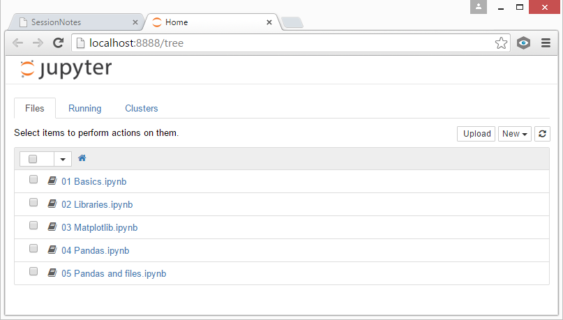
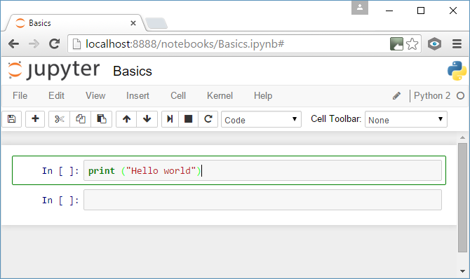

# IPython

- Interactive interpreter
- Anaconda installation give 300+ libraries and a package installation and maintenance

## Anaconda installation

Download installer for your environment, Anaconda runs on Windows, Mac OS and Linux.   

### Install

[http://docs.continuum.io/anaconda/install](http://docs.continuum.io/anaconda/install "anaconda installation")

### Update to latest version

`conda update conda`

`conda update ipython ipython-notebook ipython-qtconsole`

`conda update anaconda`

### 01 Basics

`cd <code directory>` 

`ipython.exe notebook`

When running your default browser will start `http://localhost:8888/tree`

### First note book

Need to code cells run in order.

Markdown and Latex can be used in documenting notebooks.

### 02 Libraries

As in Python libraries can be used to give access to extra functionality.

Python does not have native support for arrays.

SciPy *Fundamental library for scientific computing*

NumPy *Base N-dimensional array package*

### 03 Matploylib

Matplotlib is a python 2D plotting library which produces publication quality figures in a variety of hardcopy formats and interactive environments across platforms.
We can produce specific types of figures such as bar charts, pie charts, histograms, scatter plots, etc.
These can be output in a range of formats (SVG / PDF / PNG).

First One of iPython Notebooks 'magic commands'. %matplotlib inline puts matplotlib into the cell output rather than creating a popup window.

[http://www.labri.fr/perso/nrougier/teaching/matplotlib/#other-types-of-plots](http://www.labri.fr/perso/nrougier/teaching/matplotlib/#other-types-of-plots)

### 04 Pandas

Fast, flexible, and expressive data structures designed to make working with “relational” or “labeled” data both easy and intuitive. It aims to be the fundamental high-level building block for doing practical, real world data analysis in Python.

pandas is well suited for many different kinds of data:

- Tabular data with heterogeneously-typed columns, as in an SQL table or Excel spreadsheet
- Ordered and unordered (not necessarily fixed-frequency) time series data.
- Arbitrary matrix data (homogeneously typed or heterogeneous) with row and column labels
- Any other form of observational / statistical data sets. The data actually need not be labeled at all to be placed into a pandas data structure

[http://pandas.pydata.org/pandas-docs/stable/index.html](http://pandas.pydata.org/pandas-docs/stable/index.html)

[http://pandas.pydata.org/pandas-docs/stable/10min.html](http://pandas.pydata.org/pandas-docs/stable/10min.html)

### 05 Pandas and files

In this section we will be loading data in from flat files.
Using panda functions to explore the data and also join data from other sources.
The data we will be looking at today is that of Magazines. In future sessions we will be using this data to look at machine learning.
The data we have is of Magazines, their categories as defined by an industrial body and two sets of data one in the overall category of leisure magazines and another that is not in that category. There is data we will be wanting to automatically assign categories based on the other data.

## Links

### iPython site

[http://ipython.readthedocs.org/en/stable/](http://ipython.readthedocs.org/en/stable/ "IPython documentation")

### iPython keyboard shortcuts

[https://ipython.org/ipython-doc/1/interactive/notebook.html#keyboard-shortcuts](https://ipython.org/ipython-doc/1/interactive/notebook.html#keyboard-shortcuts "keyboard shortcuts")

### Others

[http://scipy.org](http://scipy.org)

[http://www.numpy.org](http://www.numpy.org)

[https://plot.ly/python/ipython-notebook-tutorial/](https://plot.ly/python/ipython-notebook-tutorial/)

[http://pandas.pydata.org/pandas-docs/stable/index.html](http://pandas.pydata.org/pandas-docs/stable/index.html)

[http://www.labri.fr/perso/nrougier/teaching/matplotlib/#simple-plot](http://www.labri.fr/perso/nrougier/teaching/matplotlib/#simple-plot)

[http://nbviewer.ipython.org/github/ipython/ipython/blob/1.x/examples/notebooks/Cell%20Magics.ipynb](http://nbviewer.ipython.org/github/ipython/ipython/blob/1.x/examples/notebooks/Cell%20Magics.ipynb "Magic functions")

[http://www.scipy.org/scipylib/index.html](http://www.scipy.org/scipylib/index.html)

[http://matplotlib.org/resources/index.html#books-chapters-and-articles](http://matplotlib.org/resources/index.html#books-chapters-and-articles)

### Useful commands

- ? - IPython’s features
- %quickref - Quick reference Card
- help - Python help
- object? - details about an object 
